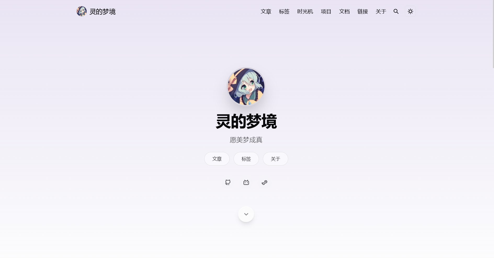
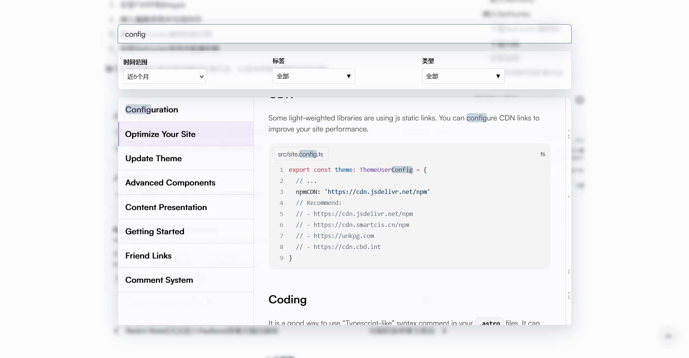
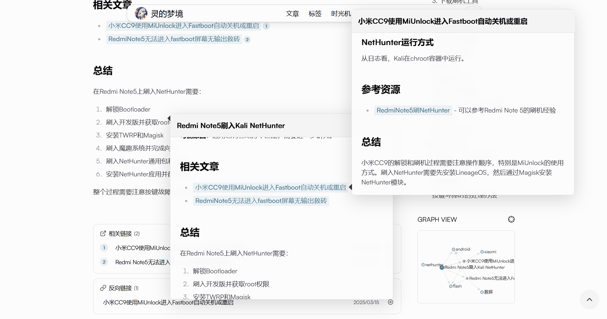

# Astro Theme Iris

English | [简体中文](./README-zh-CN.md)

<div align="center">
  
</div>

---

## 📸 Screenshots

**Demo Blog**: [https://lemonadorable.github.io/](https://lemonadorable.github.io/)

<div align="center">
  
  <p><em>Full-screen homepage with animation effects</em></p>
</div>

<div align="center">
  
  <p><em>Powerful search preview system - supports category filtering, real-time preview, and scroll markers</em></p>
</div>

<div align="center">
  
  <p><em>Wikilink preview, Graph View, and knowledge graph</em></p>
</div>

---

## 🎨 About Iris Theme

This project is customized based on [astro-theme-pure](https://github.com/cworld1/astro-theme-pure), aiming to combine **blog**, **profile**, and **knowledge base** to create a powerful personal knowledge management system.

### ✨ Core Features

#### 🔍 Powerful Search System
- **FlexSearch Full-Text Search**: High-performance search supporting multiple languages including Chinese and English
- **Three-Column Preview Layout**: Integrated search results, content preview, and scroll markers
- **Multi-Dimensional Filtering**: Filter by date range, tags, and type (article/docs)
- **Real-Time Highlighting**: Real-time search result highlighting with scroll positioning

#### 🔗 Wikilink System
- **Multi-Level Preview**: Uses Tippy.js to implement Quartz-like multi-layer preview functionality
- **Smart Positioning**: Supports backlinks and reverse positioning references
- **Smooth Interaction**: Supports nested previews

#### 🗺️ Knowledge Graph (Graph View)
- **D3.js Directed Graph**: Visualizes relationships between pages
- **Local/Global Views**: View local graph for current page or site-wide global graph
- **Node Types**: Distinguishes between articles, docs, tags, categories, and other types
- **Interactive Operations**: Supports drag, zoom, and click navigation

#### 🎨 UI Optimization
- **Full-Screen Homepage**: Immersive homepage design with animation effects
- **Gradient Background**: Article cards use light purple gradient backgrounds
- **Interactive Animations**: Interactive animation effects for avatars and friend links
- **Responsive Design**: Adapted for desktop and mobile devices

#### 💬 Comment System
- **Giscus Integration**: Comment system based on GitHub Discussions

#### 📊 Mermaid Integration
- **Mermaid Integration**: Mermaid integration for diagramming

#### 🖋️ Typst Integration
- **Typst Support**: Typst integration for high-quality mathematical equations and diagrams rendering in MDX

### 🚀 Quick Start

#### Requirements

- [Node.js](https://nodejs.org/): 18.0.0+
- [Bun](https://bun.sh/) or npm/pnpm/yarn

#### Installation

```shell
# Clone repository
git clone https://github.com/LemonAdorable/astro-theme-iris.git
cd astro-theme-iris

# Install dependencies
bun install
# or
npm install
```

#### Development

```shell
# Start development server
bun dev
# or
npm run dev

# Build project
bun run build
# or
npm run build

# Preview build result
bun preview
# or
npm run preview
```

### 📝 Todo

- [ ] English or multi-language support
- [ ] Homepage resume feature
- [ ] Package theme and new components
- [ ] More documentation and examples


### 📚 Repository Structure

```
Original Repository (cworld1/astro-theme-pure)
  └── main branch
      ↓ (sync)
Template Repository (LemonAdorable/astro-theme-iris)
  ├── upstream-sync branch (tracks original updates, periodically merges to main)
  └── main branch (default branch, iris template, branch of pure)
      ↓ (GitHub Actions auto-sync)
Deployment Repository (LemonAdorable/lemonadorable.github.io)
  └── master branch (for GitHub Pages deployment)
```

### 🙏 Acknowledgments

This project is based on the following excellent open-source projects:

- **[astro-theme-pure](https://github.com/cworld1/astro-theme-pure)** - Base theme framework
- **[FlexSearch](https://github.com/nextapps-de/flexsearch)** - High-performance full-text search engine
- **[Tippy.js](https://atomiks.github.io/tippyjs/)** - Powerful tooltip library
- **[D3.js](https://d3js.org/)** - Data visualization library
- **[Quartz](https://quartz.jzhao.xyz/)** - Knowledge base theme design concept reference
- **[Obsidian](https://obsidian.md/)** - Wikilink note concept reference

### 📞 Contact

For questions or suggestions, please feel free to contact via email

### 📋 Usage Instructions

#### Search Feature
- Press `Ctrl+K` or `Cmd+K` to open the search box
- Supports Chinese and English full-text search
- Filter by date range, tags, and type
- Click search results to navigate to corresponding pages
- Right preview area supports scroll marker positioning

#### Wikilink Preview
- Use `[[link text]]` or `[[link|display text]]` in articles to create wikilinks
- Hover over wikilinks to preview link content
- Supports multi-level nested previews
- Preview box supports interaction, click links to navigate

#### Knowledge Graph
- Graph View displayed in sidebar on article and doc pages
- Click nodes to navigate to corresponding pages
- Supports dragging nodes to adjust layout
- Click top-right button to view site-wide global graph

### ⚙️ Configuration

Main configuration file is located at `src/site.config.ts`, where you can configure:
- Basic site information (title, description, author, etc.)
- Social links
- Comment system (Giscus/Waline)
- Other theme options

### 📄 License

This project is open source under the [Apache 2.0 License](https://github.com/LemonAdorable/astro-theme-iris/main/LICENSE).

### ⭐ Star History

[](https://star-history.com/#LemonAdorable/astro-theme-iris&Date)
