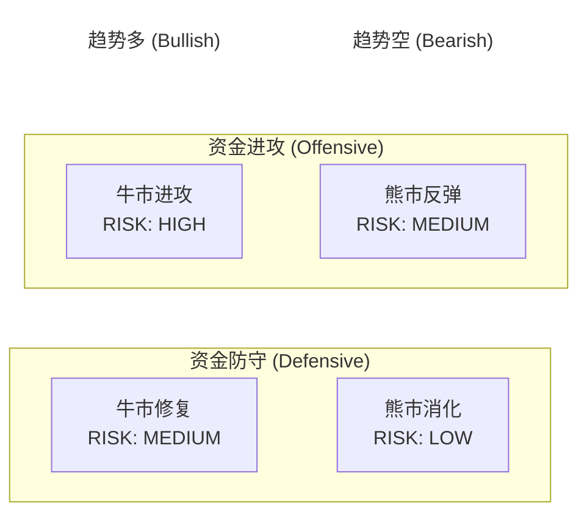

import { Aside } from 'astro-pure/user'

## 概述

在加密货币市场中，情绪往往主导着投资者的决策。**BullBear Dashboard**，这是一个基于数据的加密市场状态机。

它的核心理念是将复杂的市场分析压缩成一个**数据驱动的四象限状态机**。只需要关注两类数据：趋势结构和资金姿态，系统就能输出当前 BTC 市场处于哪一个状态，并给出风险提示。

<Aside type="caution">
本项目仅用于研究与教育，不构成任何投资建议。
</Aside>

## 核心设计

### 输入与输出

这个系统采用了直观的 Input -> Output 逻辑：

- **Input A：趋势结构**  
  通过 MA50 和 MA200 的关系来判断。
  - 输出：`Trend = 趋势多 / 趋势空`

- **Input B：资金姿态**  
  通过 Stablecoin 与 TOTAL 市值的比例来判断。
  - 输出：`Funding = 资金进攻 / 资金防守`

- **Output：四象限状态**  
  根据上述两个输入，直接定位到 4 个状态之一。

- **校验层**  
  通过 ATH（历史新高）和 ETF 数据来校验当前状态，提供风险温度和可信度提示。

### 四象限状态模型

这是系统的核心输出，旨在让用户一眼就能看清当前市场所处的位置：

1.  **资金进攻 (Offensive)**
    - **牛市进攻 (Bullish Offensive)**: RISK HIGH。市场情绪高涨，资金大量流入。
    - **熊市反弹 (Bearish Rebound)**: RISK MEDIUM。虽然处于熊市趋势，但有资金尝试抄底或反弹。

2.  **资金防守 (Defensive)**
    - **牛市修复 (Bullish Correction)**: RISK MEDIUM。牛市趋势中，资金暂时修整。
    - **熊市消化 (Bearish Consolidation)**: RISK LOW。市场低迷，资金流出或观望。



## 技术实现

项目采用前后端分离的架构：

- **后端**: Python FastAPI
  - 负责数据获取（CoinMarketCap, TAAPI等）
  - 核心状态机逻辑实现
- **前端**: Vue.js
  - 展示四象限状态图
  - actions数据更新

### 快速上手

如果你对这个项目感兴趣，可以尝试自己在本地运行：

1.  **配置环境**: Python 3.10+ 和 Node.js 环境。
2.  **后端启动**:
    ```bash
    cd backend
    pip install -r requirements.txt
    python -m uvicorn bullbear_backend.main:app --reload
    ```
3.  **前端启动**:
    ```bash
    cd frontend
    pnpm install
    pnpm dev
    ```

## 未来规划

当前版本是一个简化的 MVP（最小可行性产品）。未来的改进方向包括：

- 引入更多的数据源和指标，优化状态判断的准确性。
- 完善校验层逻辑，特别是 ETF 资金流向对市场的影响。
- 优化前端交互，提供更丰富的历史数据回溯功能。

如果你对量化交易或数据分析感兴趣，欢迎查看源码并提出建议！

---

**相关链接**:
- [GitHub 仓库](https://github.com/LemonAdorable/bullbear-dashboard)
