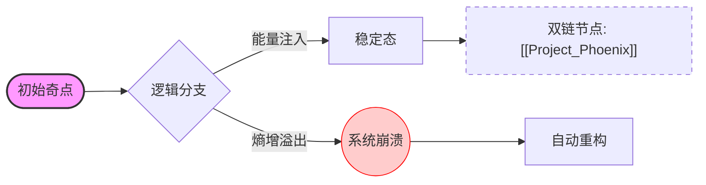

import { Typst } from 'astro-typst/src/components'

# 🌌 最终测试：超弦虚空接口

## 1. 基础排版与装饰 (Native Basics)

在 **Alpha-Phase** 协议中，所有的 *中微子* 必须经过 ~~逻辑坍缩~~ **双重冗余校验**。
此处测试行内代码：使用 `init --force-quantum` 来重置环境。

* **系统状态：** `Operational`
* **版本哈希：** `0xDEADBEEF...`
* **外部引用：** [点击访问虚空网关 (Rickroll Link)](https://www.youtube.com/watch?v=dQw4w9WgXcQ)

<iframe width="560" height="315" src="https://www.youtube.com/embed/dQw4w9WgXcQ?si=test" title="YouTube video player" frameborder="0" allow="accelerometer; autoplay; clipboard-write; encrypted-media; gyroscope; picture-in-picture; web-share" allowfullscreen></iframe>

点击查看关于虚空的定义[^2]。

<div class="flex gap-4 bg-white p-6 rounded-xl text-[#1a202c] dark:bg-[#1a1a1a] dark:text-[#f7fafc] shadow-md">
  <div class="flex-1 border border-gray-200 bg-[#f9f9f9] p-5 rounded-lg text-center shadow-sm dark:border-[#404040] dark:bg-[#2d2d2d]">
    <strong>话题池 (Topic Pool)</strong>
    <p class="text-sm opacity-70">收纳零散灵感与投稿</p>
  </div>
  <div class="flex-1 border border-gray-200 bg-[#f9f9f9] p-5 rounded-lg text-center shadow-sm dark:border-[#404040] dark:bg-[#2d2d2d]">
    <strong>活跃提案 (Proposals)</strong>
    <p class="text-sm opacity-70">正在竞标或投票中</p>
  </div>
</div>

---

## 2. 逻辑架构图 (Mermaid.js Support)

> **注意：** 渲染此部分需要前端集成 `mermaid.js`。


---

## 3. 双向链接与知识网络 (Wiki-links)

这是一个模拟双链语法的测试，常用于知识库管理：

* 参考文档：[[1]] (模拟链接到 Proposal #1)
* 相关实验：[[Topic:Governance]] (模拟链接到治理话题)
* 核心实体：[[2#overview]] (模拟链接到 Proposal #2 的锚点)

---

## 4. 任务进度与多维列表 (Task Lists & Nesting)

* [x] **任务 A：** 捕获虚数空间中的 $\aleph_0$ 级波动。
* [x] **任务 B：** 修复 `bytes32` 容器溢出。
* [ ] **任务 C：** 执行维度跨越。
    1. 调整 [[Warp_Drive]] 参数。
    2. 校准相位平衡：
        * 子项 2.1: 检查 $\Omega$ 标量。
        * 子项 2.2: 释放多余热能。
    3. 确认无误后按下 <kbd>Enter</kbd>。

---

## 5. 多维数据矩阵 (Table Alignment)

| **节点 ID** | **坐标系 (X/Y)** | **稳定性 (Entropy)** | **实时负载** |
| :--- | :---: | :--- | ---: |
| NODE-01 | `(1.2, 3.4)` | 🟢 **Stable** | 12.5% |
| NODE-42 | `(0, 0)` | 🟡 *Warning* | 89.9% |
| NODE-Σ | `NaN` | 🔴 Critical | **999%** |

---

## 6. 核心数学推导 (LaTeX Equations)

在该模型的非线性演化过程中，我们需要求解 **“广义随机偏移偏微分方程”**：

$$
\frac{\partial \Psi}{\partial t} = \int_{-\infty}^{+\infty} \frac{\xi^{k} + \gamma}{1 + e^{-\beta x}} dx + \sum_{i=1}^{n} \sqrt{\frac{\Delta A_i}{2\pi}}
$$

当 $x \to \infty$ 时，系统趋于行内平衡态 $E = mc^2 + \epsilon$。

---

* **引用测试：**
> “在虚空之中，唯一的真理是 `[[Link_Missing]]`。如果你能看到这行字，说明 Markdown 渲染器工作正常。” —— *虚空观察者* [^1]

---

## 7. 源代码实验室 (Code Highlighting)

### Solidity (用于 DApp 逻辑测试)

```solidity
function voteWithSponsor(uint256 id, uint256 amount) public {
    require(gua.balanceOf(msg.sender) > 0, "No GUA");
    uint256 weight = Math.sqrt(amount); // 测试二次方权重
    // 🌌 虚空注入逻辑
    proposals[id].score += (1 + weight);
}
```

### Python (用于数据处理测试)

```python
def calculate_entropy(data):
    import math
    # 熵增计算
    return sum([p * math.log2(1/p) for p in data if p > 0])
```

---

## 8. 扩展交互组件 (Advanced UI)

<details>
<summary><b>🛠 点击展开高级开发者工具 (Details Tag)</b></summary>

> **警告：** 修改以下参数可能导致 `bytes32` 引用错位。
> * `FLUX_CAPACITOR = 1.21GW`
> * `RETRY_POLICY = exponential_backoff`

</details>

---

## 9. 媒体占位符 (Media/Image)

使用了在线占位符图像进行测试：


---


[^1]: 来源：2026 年第 4 次虚拟会议纪要。
[^2]: 这是一个**复杂的脚注**：
    1. 包含列表。
    2. 包含[链接](https://example.com)。
    3. 甚至是代码：`void_check()`。

---

## 10. Typst 排版系统 (Typst Support)

这里我们使用 `astro-typst` 提供的组件，直接渲染 Typst 代码内容为完美的矢量图形或 HTML 结构：

<Typst code={`
#set page(width: auto, height: auto, margin: 1em)
#set text(font: "Linux Libertine", fill: rgb("#30bdc1"))

= Typst: Compose paper faster

$ cases(
  dot(x) = A x + B u,
  y = C x
) $

#table(
  columns: 4,
  [*Chinese*], [*English*], [*German*], [*Japanese*],
  [猫], [Cat], [Katze], [猫],
  [鱼], [Fish], [Fisch], [魚]
)
`} />

**Typst 测试完成**。
